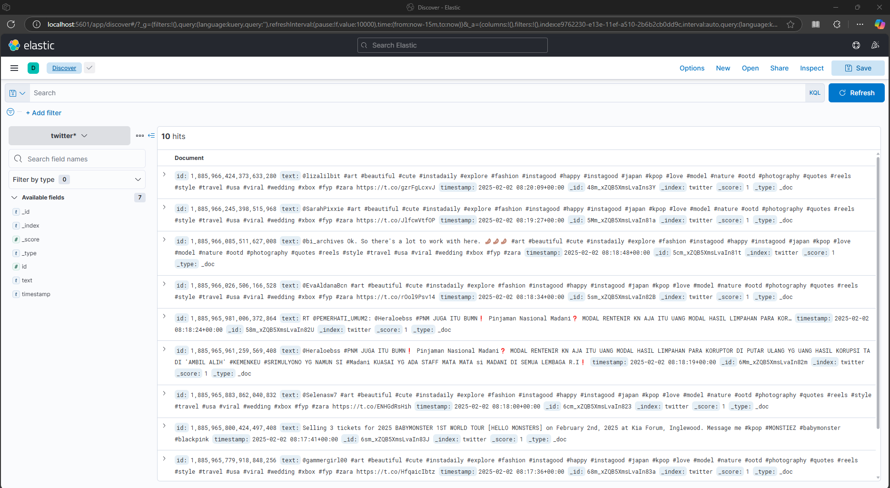

# Twitter Data Streaming with Apache Kafka, Elasticsearch, and Kibana

importank links
1. [project dashboard](https://developer.x.com/en/portal/projects/1885962543795261440/apps)

## Overview
This project streams real-time Twitter data using the **Twitter API**, processes it with **Apache Kafka**, stores it in **Elasticsearch**, and visualizes it in **Kibana**.

## Tech Stack
- **Apache Kafka** (for real-time data streaming)
- **Zookeeper** (Kafka dependency for managing metadata)
- **Twitter API** (for fetching tweets)
- **Elasticsearch** (for storing and indexing tweets)
- **Kibana** (for visualization)
- **Docker** (for containerization)
- **Python** (for Kafka producer and consumer scripts)

## Setup Instructions
### 1️⃣ Clone the Repository
```bash
git clone https://github.com/Pravesh-Sudha/twitter-streams.git
cd twitter-streams/
```

### 2️⃣ Start Docker Containers
#### Start Zookeeper
```bash
docker run -d --name zookeeper -p 2181:2181 zookeeper
```
#### Start Kafka
```bash
docker run -d --name kafka \
  --link zookeeper \
  -p 9092:9092 \
  -e KAFKA_ZOOKEEPER_CONNECT=zookeeper:2181 \
  -e KAFKA_ADVERTISED_LISTENERS=PLAINTEXT://localhost:9092 \
  -e KAFKA_OFFSETS_TOPIC_REPLICATION_FACTOR=1 \
  confluentinc/cp-kafka
```
#### Start Elasticsearch
```bash
docker run -d --name elasticsearch -p 9200:9200 -e "discovery.type=single-node" elasticsearch:7.17.10
```
#### Start Kibana
```bash
docker run -d --name kibana --link elasticsearch -p 5601:5601 kibana:7.17.10
```

### 3️⃣ Configure Twitter API Keys
Obtain API keys from [Twitter Developer Portal](https://developer.twitter.com/) and update `producer.py`:
```python
BEARER_TOKEN = "your_twitter_bearer_token"
```


### 4️⃣ Create Kafka Topic
```bash
docker exec -it kafka kafka-topics --create --topic twitter-stream --bootstrap-server localhost:9092 --partitions 1 --replication-factor 1
```

### 5️⃣ Run the Producer (Fetch Tweets and Send to Kafka)
```bash
uv pip install -r requirements.txt  #pip install --upgrade -r requirements.txt
```

```bash
python producer.py
```

### 6️⃣ Run the Consumer (Read from Kafka and Store in Elasticsearch)
```bash
python consumer.py
```

### 7️⃣ Verify Data in Elasticsearch
```bash
curl -X GET "http://localhost:9200/twitter/_search?pretty=true"
```

### 8️⃣ Visualize Tweets in Kibana
1. Open **Kibana** at `http://localhost:5601`# Twitter Data Streaming with Apache Kafka, Elasticsearch, and Kibana

## Overview
This project streams real-time Twitter data using the **Twitter API**, processes it with **Apache Kafka**, stores it in **Elasticsearch**, and visualizes it in **Kibana**.

## Tech Stack
- **Apache Kafka** (for real-time data streaming)
- **Zookeeper** (Kafka dependency for managing metadata)
- **Twitter API** (for fetching tweets)
- **Elasticsearch** (for storing and indexing tweets)
- **Kibana** (for visualization)
- **Docker** (for containerization)
- **Python** (for Kafka producer and consumer scripts)

## Setup Instructions
### 1️⃣ Clone the Repository
```bash
git clone https://github.com/Pravesh-Sudha/twitter-streams.git
cd twitter-streams/
```

### 2️⃣ Start Docker Containers
#### Start Zookeeper
```bash
docker run -d --name zookeeper -p 2181:2181 zookeeper
```
#### Start Kafka
```bash
docker run -d --name kafka \
  --link zookeeper \
  -p 9092:9092 \
  -e KAFKA_ZOOKEEPER_CONNECT=zookeeper:2181 \
  -e KAFKA_ADVERTISED_LISTENERS=PLAINTEXT://localhost:9092 \
  -e KAFKA_OFFSETS_TOPIC_REPLICATION_FACTOR=1 \
  confluentinc/cp-kafka
```
#### Start Elasticsearch
```bash
docker run -d --name elasticsearch -p 9200:9200 -e "discovery.type=single-node" elasticsearch:7.17.10
```
#### Start Kibana
```bash
docker run -d --name kibana --link elasticsearch -p 5601:5601 kibana:7.17.10
```

### 3️⃣ Configure Twitter API Keys
Obtain API keys from [Twitter Developer Portal](https://developer.twitter.com/) and update `producer.py`:
```python
BEARER_TOKEN = "your_twitter_bearer_token"
```


### 4️⃣ Create Kafka Topic
```bash
docker exec -it kafka kafka-topics --create --topic twitter-stream --bootstrap-server localhost:9092 --partitions 1 --replication-factor 1
```

### 5️⃣ Run the Producer (Fetch Tweets and Send to Kafka)
```bash
python producer.py
```

### 6️⃣ Run the Consumer (Read from Kafka and Store in Elasticsearch)
```bash
python consumer.py
```

### 7️⃣ Verify Data in Elasticsearch
```bash
curl -X GET "http://localhost:9200/twitter/_search?pretty=true"
```

### 8️⃣ Visualize Tweets in Kibana
1. Open **Kibana** at `http://localhost:5601`
2. Go to **Management → Stack Management → Index Patterns**
3. Create Index Pattern: **`twitter`**
4. Use **Discover** or **Visualizations** to explore tweets

## Features
✅ Fetches real-time tweets using **Twitter API**  
✅ Streams tweets to **Apache Kafka**  
✅ Stores tweets in **Elasticsearch**  
✅ Visualizes tweets using **Kibana**  
✅ Uses **Docker** for easy setup  

## Author
[Pravesh Sudha](https://github.com/Pravesh-Sudha)

## License
This project is licensed under the MIT License.


2. Go to **Management → Stack Management → Index Patterns**
3. Create Index Pattern: **`twitter`**
4. Use **Discover** or **Visualizations** to explore tweets



## Features
✅ Fetches real-time tweets using **Twitter API**  
✅ Streams tweets to **Apache Kafka**  
✅ Stores tweets in **Elasticsearch**  
✅ Visualizes tweets using **Kibana**  
✅ Uses **Docker** for easy setup  

## Author
[Pravesh Sudha](https://github.com/Pravesh-Sudha)

## License
This project is licensed under the MIT License.

---

# 🧠 Knowledge Map for Twitter → Kafka → Elasticsearch Pipeline

---

## 1. **Kafka: Message Broker / Streaming Platform**

### 🔹 What is Kafka?

* Kafka is a **distributed event streaming system**.
* Think of it as a **central hub** where data flows between services.
* It stores messages in **topics**, and allows:

  * **Producers** to write to topics.
  * **Consumers** to read from topics.

### 🔹 Why is Kafka used?

* To **decouple systems**: Twitter fetcher doesn’t care what happens next.
* To **stream data in real time**.
* To **persist data temporarily** for fault tolerance.

### 🔹 How Kafka Works in This Project

| Role     | What it Does                                                                                  |
| -------- | --------------------------------------------------------------------------------------------- |
| Producer | Takes tweets from Twitter API and pushes to Kafka topic `twitter-stream`.                     |
| Consumer | Listens to the topic `twitter-stream`, processes the tweets, and sends them to Elasticsearch. |

### 🔹 Key Kafka Concepts

* **Topic**: A channel where messages are published.
* **Partition**: Splits topic into pieces for scalability.
* **Producer**: App that sends data to a topic.
* **Consumer**: App that listens to and processes data from a topic.
* **Broker**: A Kafka server.
* **Offset**: A message's position in a partition.

---

## 2. **Tweepy + Twitter API v2: Data Source**

### 🔹 What is it?

* Tweepy is a Python wrapper around the **Twitter API v2**.
* The API gives access to:

  * Tweets (recent, filtered, live, historical)
  * User data, trends, etc.

### 🔹 In This Project

* The Twitter API is used to **pull recent tweets** based on a query (e.g. `#madani`).
* These tweets are then pushed into Kafka.

### 🔹 Key Concepts

* **Bearer Token**: Used for authentication with the Twitter API.
* **Search query**: Filters tweets (e.g., hashtag, exclude retweets).
* **Rate limits**: APIs have usage caps; must manage requests.

---

## 3. **Elasticsearch: Searchable Data Store**

### 🔹 What is Elasticsearch?

* A **NoSQL search engine** for fast, scalable full-text search.
* Stores documents in a structure like JSON.
* Indexes every word so you can search/filter instantly.

### 🔹 Why use it?

* To **store** tweet data.
* To make it **searchable by keyword, time, etc**.

### 🔹 In This Project

* Tweets read from Kafka are sent to Elasticsearch.
* You can later query tweets by ID, text, timestamp, etc.

### 🔹 Key Concepts

* **Index**: Like a database table (e.g., `twitter`).
* **Document**: A JSON record (one tweet).
* **Mapping**: Defines the structure of documents.
* **Ingest**: Sending data to ES via POST requests.

---

## 4. **Data Flow Overview**

```
[ Twitter API ]
      ↓
[ Kafka Producer ]
      ↓
[ Kafka Topic: twitter-stream ]
      ↓
[ Kafka Consumer ]
      ↓
[ Elasticsearch ]
```

Each layer is **modular**:

* Can replace Twitter with another data source.
* Can replace Elasticsearch with another DB.
* Kafka decouples the components.

---

## 5. **Data Engineering Mindset**

To build, debug, and extend this project, you need to understand:

| Domain                 | Concepts You Should Know                                                      |
| ---------------------- | ----------------------------------------------------------------------------- |
| **Streaming Systems**  | Kafka, topics, producers, consumers, offsets, real-time processing            |
| **APIs**               | REST APIs, rate limiting, authentication (Bearer tokens), data formats        |
| **Data Serialization** | JSON encoding/decoding, byte streams (for Kafka)                              |
| **Search Systems**     | Elasticsearch indexing, querying, document structures                         |
| **DevOps Basics**      | Running services (Kafka, ES), networking (`localhost:9092`, `localhost:9200`) |
| **Error Handling**     | Retry logic, rate limiting, logging, resilience                               |
| **Observability**      | Logs, health checks, status of Kafka/ES                                       |

---

## 6. 📚 Suggested Learning Path (If Starting Fresh)

1. **Kafka**

   * What is a message broker?
   * Understand producers, consumers, topics, offsets.
   * Install and run a local Kafka cluster.

2. **Twitter API**

   * Learn how to authenticate and search tweets.
   * Understand tweet objects and search filters.

3. **JSON & Serialization**

   * Understand how data moves as JSON.
   * Know how to serialize and deserialize data.

4. **Elasticsearch**

   * Install ES locally.
   * Learn how to store and query documents.
   * Understand index mappings.

5. **Pipeline Assembly**

   * Combine: Pull from Twitter → Push to Kafka → Read from Kafka → Push to Elasticsearch.

6. **(Optional) Visualization**

   * Use tools like Kibana or Grafana to visualize tweet trends.


